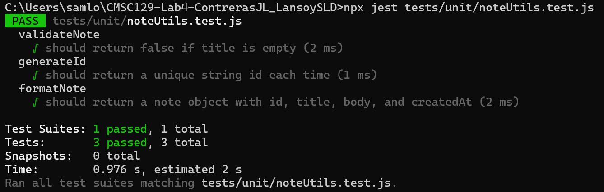

# CMSC129-Lab4-LastNameFNI

## Live URL
> _To be added after deployment_

---

## App Description

This is a simple note-taking web application built as a single-resource CRUD app. Users can create, view, update, and delete personal notes. Each note has a title and a body. Data is stored in-memory on the server side. The app is built using React (Vite) for the frontend and Express for the backend and follows a Test-Driven Development (TDD) workflow.

---

## User Stories

1. As a user, I want to create a note with a title and body, so that I can save and write my thoughts.
2. As a user, I want to view all my notes in a list, so that I'll be able to find them later.
3. As a user, I want to delete a note, so that I can remove notes I don't need anymore.

---

## Tech Stack

| Layer | Technology |
|---|---|
| Frontend | React (Vite) |
| Backend | Node.js + Express |
| Data Storage | In-memory array (server-side) |
| Unit Testing | Jest |
| Integration Testing | Jest + Supertest |
| System / E2E Testing | Playwright |
| CI/CD | GitHub Actions |
| Deployment | Vercel (frontend) |

---

## Testing Strategy

**Unit tests** will cover all isolated business logic functions. This will include the note validation like the title must not be empty and body must not exceed character limit, and generating of ID. These tests do not touch HTTP or the browser.

**Integration tests** will cover the full HTTP request-response cycle using Supertest. Specifically, a POST request to create a note and a GET request to retrieve all notes, making sure that it verifies correct status codes and response bodies.

**System tests** will simulate real user journeys in a browser using Playwright. One test per user story: creating a note using the UI, viewing the notes list, and deleting a note. This verifies that  DOM reflects the expected state after each action.

---

## Test Results

### Unit Tests




## Setup Instructions

### Clone the repository
```bash
git clone https://github.com/CMSC129-LABS/CMSC129-Lab4-ContrerasJL_LansoySLD
cd CMSC129-Lab4-CMSC129-Lab4-ContrerasJL_LansoySLD
``` 

### Install frontend dependencies
```bash
cd client
npm install
``` 

###  Install backend dependencies
```bash
cd ../server
npm install
``` 

### Run the frontend (from /client)
```bash
npm run dev
``` 

### Run the backend (from /server)
```bash
node index.js
``` 

### Run unit + integration tests (from /server)
```bash
npx jest
```

### Run system tests (from /client)
```bash
npx playwright test
```